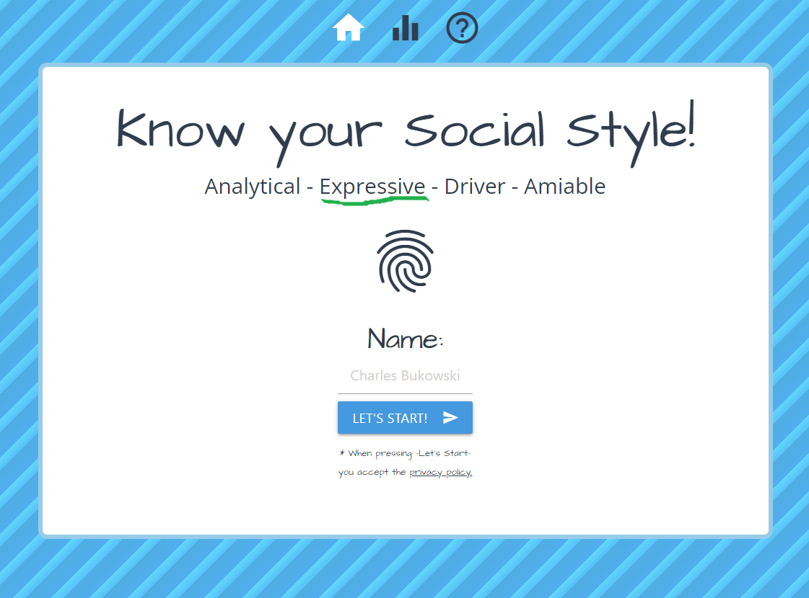

<p align="center">
  <a href="https://marfullsen.github.io/social-styles/" rel="noopener">
 </a>
</p>

<div align="center">

# Know your Social Style!

[](https://marfullsen.github.io/social-styles/)
[](https://v3.vuejs.org/)
[](https://vitejs.dev/)
[](https://router.vuejs.org/)
[](https://materializecss.com/)

</div>

<p align="center">
  Interactive test to obtain information on social styles
</p>

## New features!

- Translated version from Spanish to English.
- Inner migration from WebPack to Vite.
- Improved background pattern.
- Docs translated and updated.

## 📝 Contents

- [What is the social style test?](#about)
- [Getting started!](#getting_started)
- [Deployment](#deployment)
- [Usage](#usage)
- [Built Using](#built_using)
- [Authors](#authors)
- [References](#acknowledgement)

## 🧐 What is the social style test? <a name = "about"></a>

<p align="center">
  <a href="https://marfullsen.github.io/social-styles/" rel="noopener">
 </a>
</p>

According to Bolton's model, the Interpersonal Social Style Test is a test of alternatives that makes it possible to determine the level of assertiveness and emotionality of a person, with both values it is possible to determine the person's social style.

## 🏁 Getting started! <a name = "getting_started"></a>

First steps:

To start the test just type your name and click the "Start!" button.

After answering the 18 questions you will get a map with your social style marked with a red dot.

<p align="center">
  <a href="https://marfullsen.github.io/social-styles/" rel="noopener">
 </a>
</p>

It also includes information on the style obtained, levels of assertiveness and emotionality.

### Take the test and/or improve the code.

#### Steps to perform the test.

- Open a browser (Chrome, Firefox, Edge, Opera, Safari)
- Go to [https://marfullsen.github.io/social-styles/](https://marfullsen.github.io/social-styles/)
- Take the test, no installation needed.

#### To edit the code

- Install Node.js
- Install pnpm (or use npm, yarn, bun, etc)

### Installing


```
git clone https://marfullsen.github.io/social-styles.git

cd social-styles

pnpm install

```

## Further info
### Score

The scoring system was implemented through an external server, to display real data it must be configured manually, otherwise the system will display a fixed table with fictitious results.

<p align="center">
  <a href="https://marfullsen.github.io/social-styles/score" rel="noopener">
 </a>
</p>

## 🔧 Test <a name = "tests"></a>

NO TEST YET. (Feel free to send them through pull requests)

```
npm run test:unit
```

## 🎈 Usage <a name="usage"></a>

```
pnpm run dev
```

- Open the browser in the url specified in the console, by default should be [127.0.0.1:5173](http://localhost:5173/)

## 🚀 Deployment <a name = "deployment"></a>

When moving to the production phase, it is recommended to **create a file called 404.html** with the same content that has the **index.html** file, this to ensure that the Vue router manages to redirect to the standard url and does not fall on the **404.html** page provided by Github.

## ⛏️ Built using <a name = "built_using"></a>

- [Vue.js](https://vuejs.org/) - JavaScript Framework for FrontEnd.
- [Vite](https://vitejs.dev/) - Local development server for FrontEnd.


## ✍️ Author <a name = "authors"></a>

- [@Marfullsen](https://github.com/Marfullsen) - Software Developer.

## 🎉 References <a name = "acknowledgement"></a>

- [The Social Styles model](https://www.bitesizelearning.co.uk/resources/how-social-styles-can-help-you-to-achieve-your-communication-goals)
- [Repo "Test Estilos Sociales" (Spanish version)](https://github.com/Marfullsen/estilos-sociales)
- [Test in spanish](https://marfullsen.github.io/estilos-sociales/)
- [Materialize CSS](https://materializecss.com/)
- favicon de un [portapapeles](https://www.stockio.com/free-icon/stationery-clipboard)
- Share Buttons por [sharethis.com](https://sharethis.com/)
- [La Versatilidad y los 4 Estilos Sociales por Wilson Learning](https://www.businessupgroup.com/post/la-versatilidad-y-los-4-estilos-sociales)